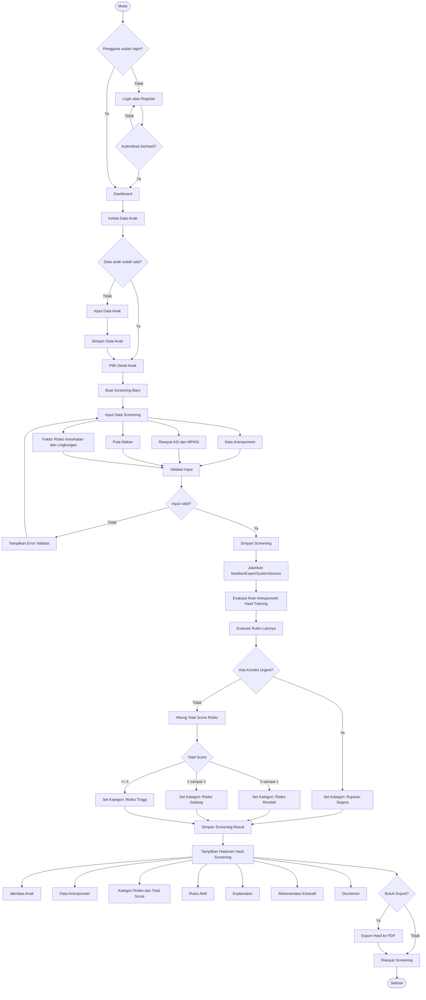
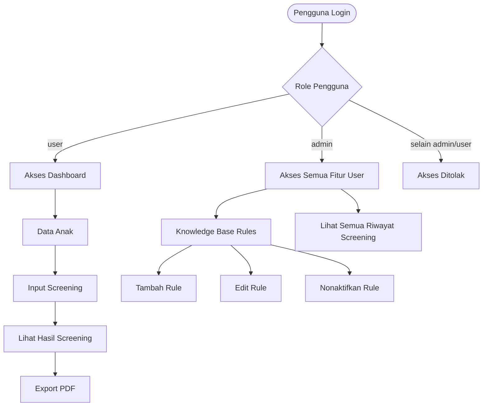
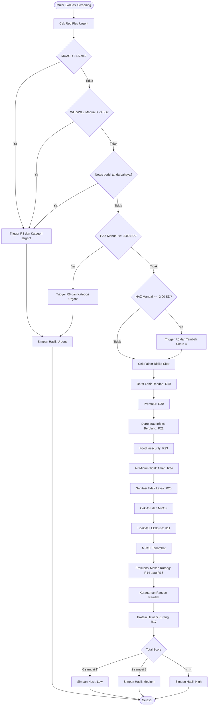
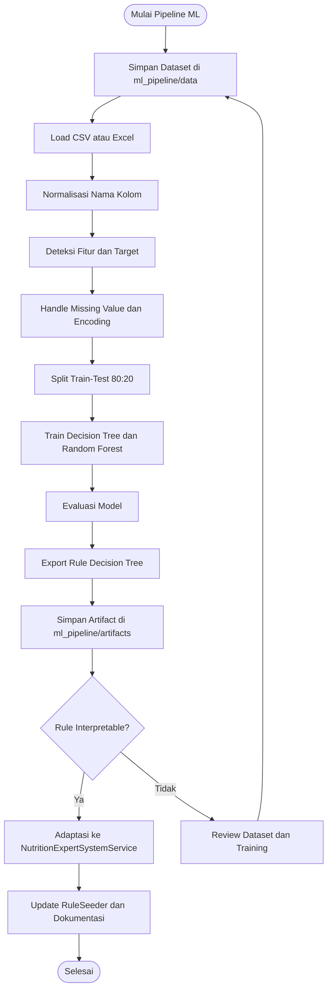

# Flowchart Alur Sistem NutriScreen-ES

Dokumen ini berisi flowchart alur utama aplikasi NutriScreen-ES untuk kebutuhan presentasi dan dokumentasi ESDLC.

Catatan update: sistem saat ini sudah mengadaptasi rule hasil training Decision Tree dari `ml_pipeline/artifacts/extracted_rules.txt`. Rule utama yang dipakai adalah `height_for_age_z_score <= -2.00` untuk menandai risiko stunting (`R5`). Sistem juga mempertahankan rule stunting berat (`R6`) pada `height_for_age_z_score <= -3.00`.

## Flowchart Utama

## Flowchart Role dan Hak Akses

## Flowchart Rule-Based Reasoning

## Flowchart Pipeline ML dan Adaptasi Rule

## Ringkasan Alur untuk Presentasi

1. Pengguna login ke sistem.
2. Pengguna menambahkan atau memilih data anak.
3. Pengguna mengisi form screening.
4. Sistem memvalidasi dan menyimpan input.
5. Service sistem pakar menjalankan rules, termasuk rule stunting hasil training Decision Tree.
6. Sistem menyimpan hasil kategori risiko, skor, rules aktif, explanation, dan rekomendasi.
7. Pengguna melihat hasil screening dan dapat export PDF.
8. Admin dapat mengelola dokumentasi knowledge base rules.
9. Pipeline ML dapat dijalankan ulang saat dataset diperbarui untuk mengevaluasi model dan mengekstrak rule baru.
